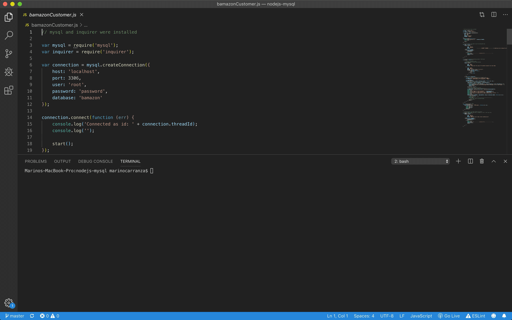
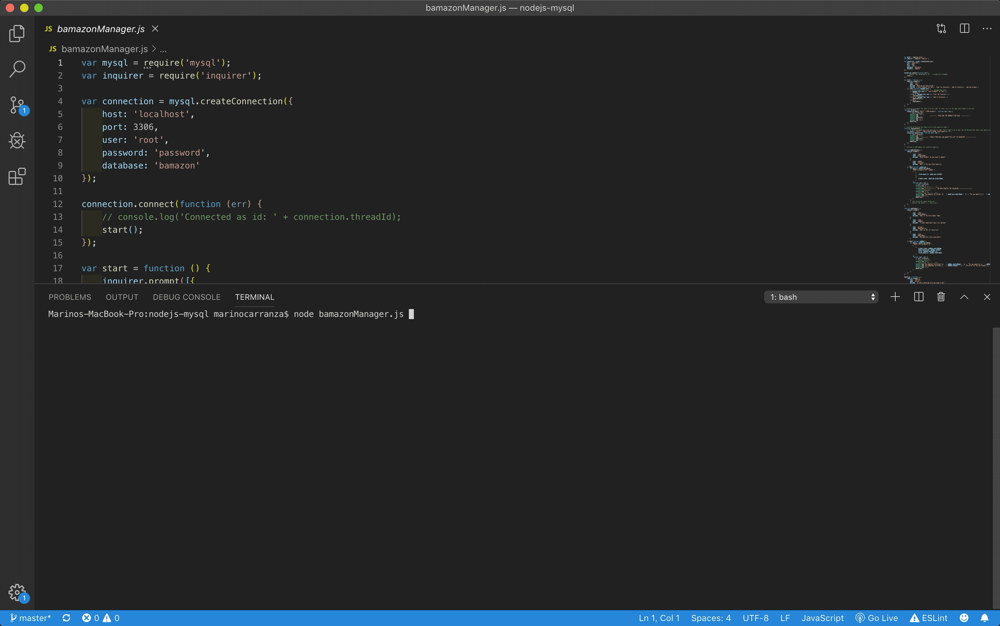
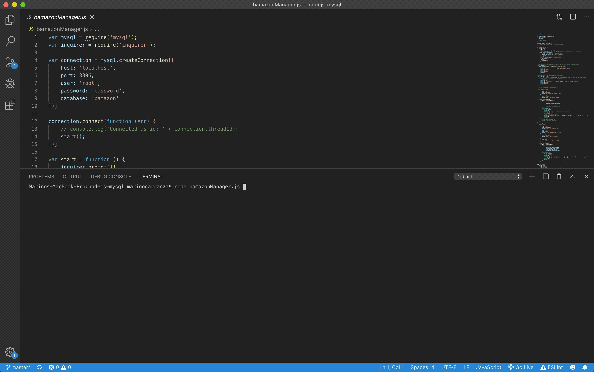
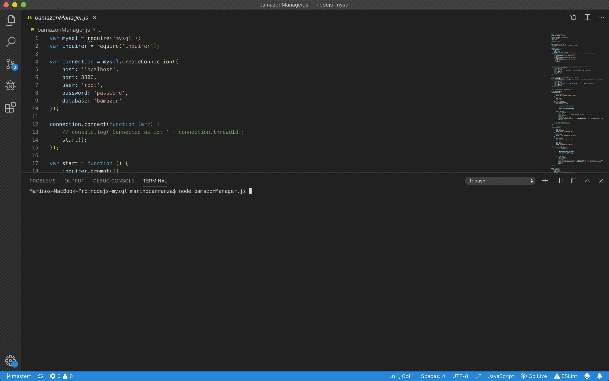

# **nodejs-mysql**

## **User = Customer**

This app creates a storefront utilizing MySQL. The app takes in orders from customers and depletes stock from the store's inventory.
The following gif, shows the user responding to prompts for selecting the item to buy and the quantity desired; once those inputs are captured, the app displays the amount to pay and asks the user if they wish to continue; if the answer is yes, the app displays the updated table of products and the prompt to choose an item; if the answer is no, the app ends with a "good bye" message.

 

 ## **User = Manager**

  Built in a similar fashion as the "Customer" app, this app takes input from the user (in this case the store Manager), and allows the user to view the products for sale, view the products with low stock quantity, update the quantity of existing products or add new products.
  After each task the user is prompt to answer if another task is required and the app either executes the chosen task or quits with a "good bye" message.
  The following gif shows the user choosing to see the inventory and the products with quantities under 5 items.

  

    The following gif shows the user updating the inventory.

 

  The following gif shows the user adding a new product.
  

  Thanks for taking the time to take a look at my app.

  Mariño Carranza.
  

